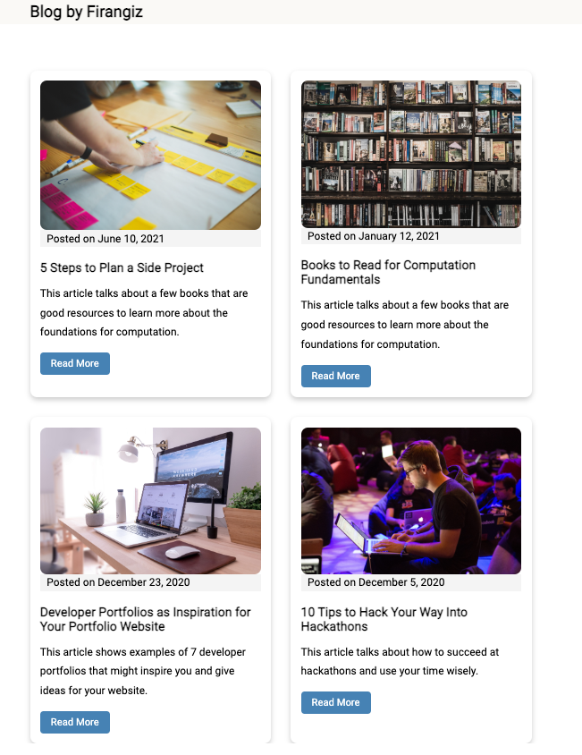

This is a Next.js Static Blog project with Markdown. To run it, start the development server: 
```bash
npm run dev
# or
yarn dev
```

Open [http://localhost:3000](http://localhost:3000) with your browser to see the result.

Additionally, this project is deployed with Vercel and is live at [this link](https://blog-chi-orpin.vercel.app/). The blog posts are written in markdown and are extracted from a couple of articles I wrote on dev.to, which you can check out [here](https://dev.to/firangizg).

Dependencies: 
run ```npm i marked gray-matter```

<p align="center">
  
</p>
